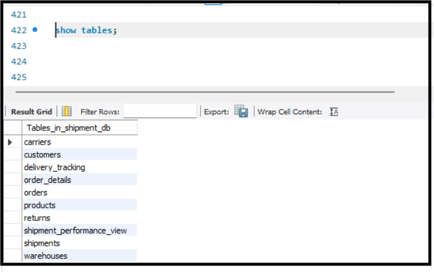
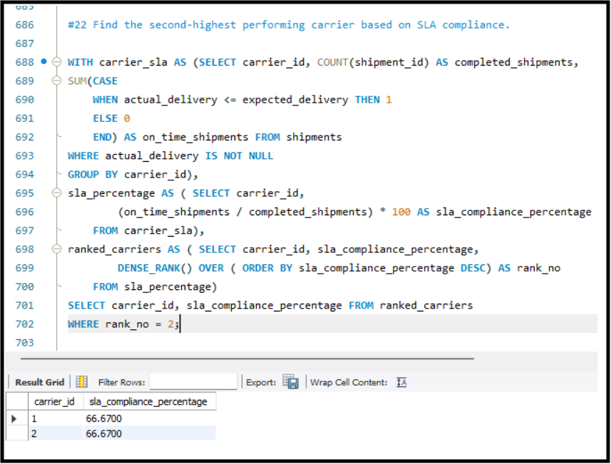
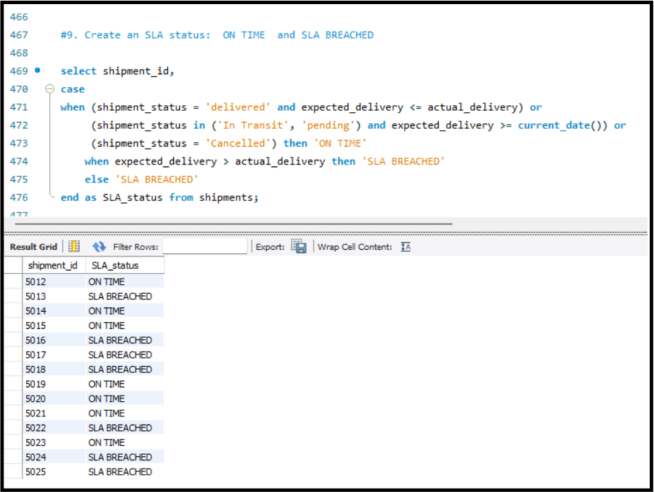

# Supply Chain Shipment & Delivery SLA Analytics
SQL-based analytics project for analyzing supply chain shipments, delivery performance, SLA compliance, carrier performance, warehouse performance, and returns using **MySQL**.

📌 Project Overview

This project analyzes supply chain shipment and delivery data to understand:

* Customer order patterns
* Shipment and delivery performance
* Carrier performance
* SLA compliance and SLA breaches
* Warehouse delivery performance
* Monthly order and shipment trends
* Customer spending
* Product returns and return rates

The project uses multiple related tables and SQL queries to transform raw transactional data into meaningful business insights.

🗂️ Database Structure

The project contains the following tables:

* Customers
* Products
* Warehouses
* Orders
* Order_Details
* Carriers
* Shipments
* Delivery_Tracking
* Returns

🛠️ Tools & Technologies

* MySQL Workbench
* GitHub

💡 SQL Concepts Used

* CREATE TABLE
* Primary Keys & Foreign Keys
* Constraints
* INSERT
* SELECT
* WHERE
* ORDER BY
* GROUP BY
* HAVING
* JOINs
* LEFT JOIN
* Subqueries
* CTEs
* CASE Statements
* Aggregate Functions
* Date Functions
* DATEDIFF
* Window Functions
* RANK()
* DENSE_RANK()
* Views
* Indexes

📊 Key Analysis

The project includes analysis for:

1. Customer and order information
2. Customers with the highest order values
3. Customers who have never placed an order
4. Shipment count by carrier
5. Delayed shipments
6. Delivery time analysis
7. Carrier SLA compliance percentage
8. Top carriers by region
9. Average delivery time by warehouse
10. Warehouse delayed shipment analysis
11. Monthly order and shipment trends
12. Customers spending above the average
13. Shipment performance using a SQL View
14. Regional SLA breach percentage
15. Product return rate
16. Customers with multiple orders and returned products

📁 Project Structure

```text
supply-chain-shipment-sla-analytics/
│
├── README.md
│
├── sql/
│   ├── 01_create_tables.sql
│   ├── 02_insert_data.sql
│   ├── 03_basic_queries.sql
│   ├── 04_advanced_queries.sql
│   └── 05_views_indexes.sql
│
└── screenshots/
    ├── 01_database_tables.png
    ├── 02_join_analysis.png
    ├── 03_advanced_sla_analysis.png
    ├── 04_delivery_sla.png
    └── 05_view_output.png
```

## 📸 Project Screenshots

### Database Tables



### JOIN Analysis


### Advanced SLA Analysis



### Delivery SLA Analysis




## 🎯 Project Objective

The objective of this project is to use SQL to analyze supply chain operations and identify patterns in shipment performance, delivery timelines, SLA compliance, carrier performance, warehouse performance, and product returns.

## 🔗 Repository

GitHub:
https://github.com/kavitha29g/supply-chain-shipment-sla-analytics
